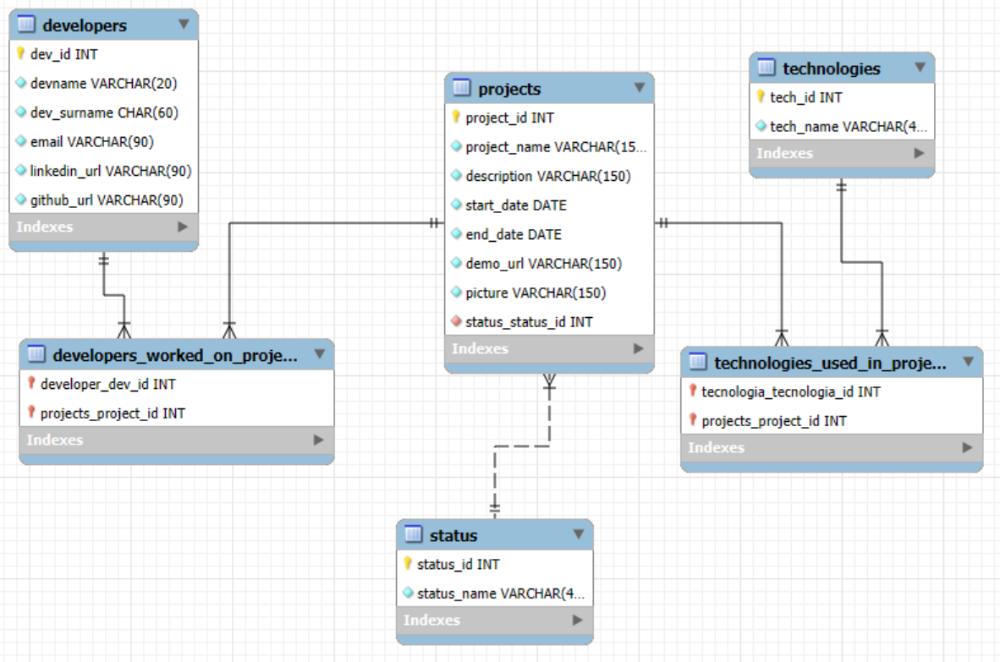

# 📘 API REST – Gestión de Proyectos
Proyecto de la asignatura — Optativa

Este proyecto consiste en el desarrollo de una API REST completa para la gestión de proyectos, desarrolladores, tecnologías y estados.

El servidor sigue el patrón:

Controlador → Servicio → Repositorio → Base de Datos


Asimismo, implementa todas las funcionalidades exigidas por el enunciado del trabajo, incluyendo documentación, arquitectura clara y endpoints totalmente funcionales.

--- 

## 📁 Estructura del Proyecto
```
src/
 └── main/
     ├── java/
     │   └── com/example/Proyectos/
     │        ├── controller/
     │        ├── service/
     │        │     └── impl/
     │        ├── persistence/
     │        │     ├── model/
     │        │     └── repository/
     │        ├── converter/
     │        └── dto/
     └── resources/
         └── application.properties
```

---

## 🗄️ Modelo de Base de Datos

La base de datos contiene las siguientes entidades:

- **projects**

- **developers**

- **technologies**

- **status**

Tablas intermedias ManyToMany:

- *developers_worked_on_projects*

- *technologies_used_in_projects*

---

## 📊 Diagrama de relaciones
```
Project 1 --- n Status
Project n --- n Developers
Project n --- n Technologies
```
---

## 🚀 Tecnologías principales utilizadas

- **Java**

- **Spring Boot**

- **MySQL**

- **Maven**

---

## 🌐 URL Base de la API
```
/api/v1
```

## 📌 Endpoints implementados (OBLIGATORIOS)

A continuación se describen todos los endpoints que la API soporta.

## 🧩 1. PROJECTS
### ✔ GET — Obtener todos los proyectos

Incluye: estado + tecnologías + desarrolladores

GET /api/v1/projects

Ejemplo de respuesta:
```json
[
  {
    "projectId": 1,
    "projectName": "Portfolio Web",
    "description": "...",
    "status": { "statusId": 1, "statusName": "Completed" },
    "developers": [
      { "devId": 4, "devName": "Laura", "devSurname": "Méndez" }
    ],
    "technologies": [
      { "techId": 2, "techName": "React" }
    ]
  }
]
```

### ✔ GET — Buscar proyectos por palabra
GET /api/v1/projects/{word}

Busca proyectos cuyo nombre contenga la palabra indicada, sin importar mayúsculas/minúsculas.

### ✔ POST — Crear proyecto
POST /api/v1/projects

### ✔ PUT — Editar proyecto
PUT /api/v1/projects/{id}

### ✔ DELETE — Eliminar proyecto
DELETE /api/v1/projects/{id}

--- 

## 🧩 2. DEVELOPERS
### ✔ GET — Obtener todos
GET /api/v1/developers

### ✔ POST — Insertar programador
POST /api/v1/developers

### ✔ PUT — Editar programador
PUT /api/v1/developers/{id}

### ✔ DELETE — Borrar programador
DELETE /api/v1/developers/{id}

---

## 🧩 3. TECHNOLOGIES
### ✔ GET — Obtener todas las tecnologías
GET /api/v1/technologies

### ✔ POST — Insertar tecnología
POST /api/v1/technologies

### ✔ PUT — Editar tecnología
PUT /api/v1/technologies/{id}

### ✔ DELETE — Borrar tecnología
DELETE /api/v1/technologies/{id}

---

## 🧩 4. STATUS
### ✔ GET — Obtener todos los estados
GET /api/v1/status

---

## 🧠 Arquitectura
### ✔ Controladores

Gestionan las peticiones HTTP y devuelven ResponseEntity con códigos apropiados.

### ✔ Servicios

Implementan la lógica de negocio sin tocar directamente la base de datos.

### ✔ Repositorios

Gestionan la comunicación con la base de datos usando JPA.

## ⚙️ Configuración

En application.yml:

```yml
spring:
  application:
    name: Producto
  profiles:
    active: local
  datasource:
    url: jdbc:mysql://localhost:3306/ProyectosDb?createDatabaseIfNotExist=true&useUnicode=true&useJDBCCompliantTimezoneShift=true&useLegacyDatetimeCode=false&serverTimezone=UTC
    username: root
    password: root
    driver-class-name: com.mysql.cj.jdbc.Driver
  jpa:
    hibernate:
      ddl-auto: none
```

---

## ▶️ Ejecución del servidor

Desde consola:
```bash
mvn spring-boot:run
```
---

## 🎨 Documentos gráficos incluidos



--- 
## 🎉 Estado del proyecto

✔ Todos los endpoints obligatorios implementados
✔ Arquitectura MVC/CSR correcta
✔ Respuestas con ResponseEntity
✔ Documentación completa
✔ Relaciones integradas

--- 

## 🧾 Autor : Francisco Munzón Medina
© 2025 - Desarrollado por Francisco Munzón Medina